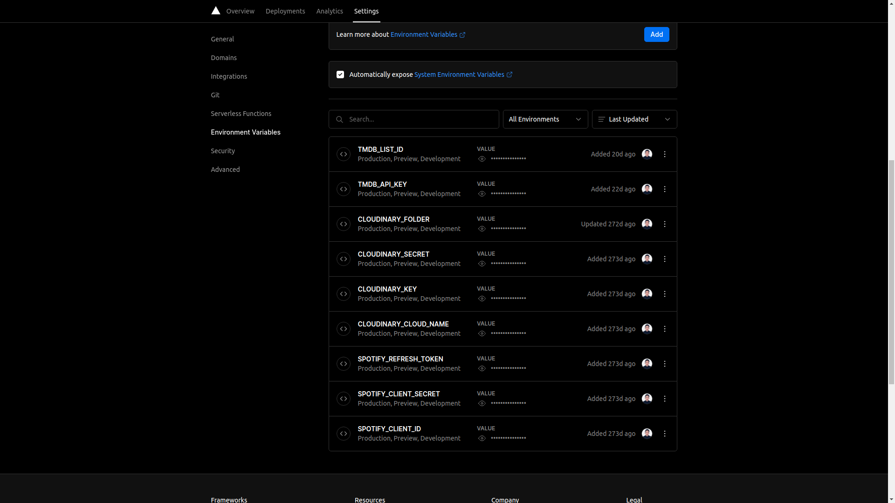

# earvinpiamonte.com

Welcome to the repository of my website since 2021. Built with [Next.js](https://nextjs.org/) and deployed on [Vercel](https://vercel.com/).

## Prerequisites

- [Spotify](https://developer.spotify.com/) Web API - cliend ID, secret and token
- [Cloudinary](https://cloudinary.com/) API - cloud name, key, secret and folder
- [TMDB](https://www.themoviedb.org/settings/api) API - API Key (v3 auth)
- [Vercel CLI](https://vercel.com/cli) - CLI for local development

## File structure

- `api/*` - API endpoints with Vercel

- `components/*` - reusable stuff

- `data/*` - blog posts, crafts, experiences, dynamic pages and projects

- `lib/*` - server and client side scripts, mostly server side

- `pages/*` - web pages

- `public/images/*` - site and blog post images

- `server/*` - contains a JSON config for server processing

- `styles/global.css` - global CSS file with Tailwind CSS

- `templates/*` - page templates

- `types/index.tsx` - enums, types and interfaces
- `.env.example` - required env file

## Local development

```sh
git clone https://github.com/earvinpiamonte/earvinpiamonte.com.git
```

```sh
cd earvinpiamonte.com/
```

```sh
npm i
```

```sh
vercel dev
```

Finally, manually add the environment variables from `.env.example` to the Vercel deployment > "Settings" > "Environment Variables". Make sure to update the values accordingly.



Restart development server if necessary:

```sh
vercel dev
```

## Production

View the website at [earvinpiamonte.com](https://www.earvinpiamonte.com/).
